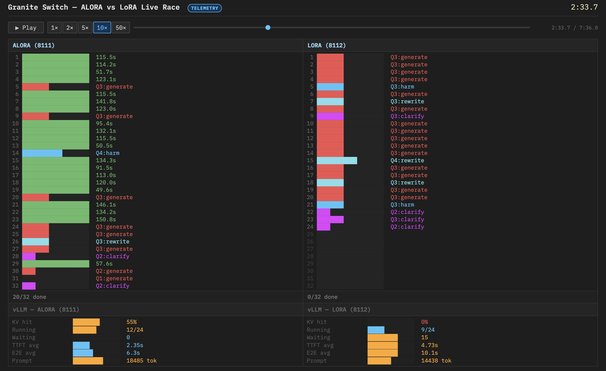

# Granite Switch — Build AI models like you build software

[](LICENSE)
[](https://www.python.org/downloads/)
[](https://huggingface.co/ibm-granite/granitelib-core-r1.0)
[](https://huggingface.co/ibm-granite/granitelib-rag-r1.0)
[](https://huggingface.co/ibm-granite/granitelib-guardian-r1.0)

| [**Browse Adapters**](https://generative-computing.github.io/granite-switch/adapter_catalog.html) | [Pre-composed Models on HF](https://huggingface.co/ibm-granite/granite-switch-4.1-8b-preview) | [Tutorials](tutorials/README.md) |

Software is built from libraries — you pick the ones you need, compose them, and ship. Granite Switch brings this to AI models, starting with the Granite family: choose adapters for RAG, safety, factuality, and more, compose them into a single model, and deploy with one command. Swap or upgrade any component independently, just like updating a dependency.

Small models with the right adapters consistently outperform much larger generalist models on targeted tasks. **Activated LoRA (aLoRA)** makes this practical at scale: all adapters share one KV cache, activating on demand — so one deployment serves many capabilities with no memory or latency overhead.

<p align="center">
  
</p>

## Key Features

- **Composable** — Combine independently developed adapters into one checkpoint, whether IBM's or yours. Swap, upgrade, or customize without retraining.
- **Fast** — Built on IBM's Activated LoRA technology for efficient KV cache reuse, low latency, and [high inference throughput](https://generative-computing.github.io/granite-switch/race_live.html).
- **Accurate** — Task-specific adapters can match and even surpass the accuracy of significantly larger generalist models, while requiring only a fraction of the serving cost. See the [adapter catalog](https://generative-computing.github.io/granite-switch/adapter_catalog.html#hallucination-detection) for benchmark comparisons across all 12 adapters.
- **Inference-ready** — Deploy with vLLM for production or HuggingFace for prototyping. Same checkpoint, no conversion step.

<p align="center">
  <a href="https://generative-computing.github.io/granite-switch/race_live.html">
    
  </a>
</p>

<p align="center"><em>aLoRA completes 20 of 32 RAG queries while standard LoRA is still waiting — same model, same hardware, different adapter technology.</em><br>
<a href="https://colab.research.google.com/github/generative-computing/granite-switch/blob/main/tutorials/notebooks/05_alora_vs_lora_race.ipynb">Reproduce it yourself on Colab →</a></p>

## Quick Start

### Install

```bash
pip install "granite-switch[vllm]"
```

Other install options depending on your use case:

```bash
pip install "granite-switch[compose]"   # Compose modular models
pip install "granite-switch[hf]"        # HuggingFace inference
pip install "granite-switch[vllm20]"    # vLLM 0.20+ (requires CUDA 13+)
pip install "granite-switch[dev]"       # Everything
```

Requires Python 3.9+ and PyTorch 2.0+. Two vLLM backends are available: `.[vllm]` for broad CUDA 12.x compatibility (0.19.x), and `.[vllm20]` for the latest performance improvements (CUDA 13+).

### Compose a Model

Compose a base Granite model with adapter libraries into a single deployable checkpoint:

```bash
python -m granite_switch.composer.compose_granite_switch \
  --base-model ibm-granite/granite-4.1-3b \
  --adapters ibm-granite/granitelib-core-r1.0 ibm-granite/granitelib-rag-r1.0  ibm-granite/granitelib-guardian-r1.0 \
  --output ./my-model
```

Use the **[Adapter Composer](https://generative-computing.github.io/granite-switch/adapter_catalog.html)** to browse available adapters, compare benchmarks, and generate a ready-to-run compose command.

This downloads the base model, embeds compatible LoRA adapters (with a preference towards activated LoRA), adds control tokens and a chat template, and produces a model directory that works with both HuggingFace and vLLM.

**Or skip composition and use a pre-composed model:**

- [ibm-granite/granite-switch-4.1-3b-preview](https://huggingface.co/ibm-granite/granite-switch-4.1-3b-preview)
- [ibm-granite/granite-switch-4.1-8b-preview](https://huggingface.co/ibm-granite/granite-switch-4.1-8b-preview)
- [ibm-granite/granite-switch-4.1-30b-preview](https://huggingface.co/ibm-granite/granite-switch-4.1-30b-preview)

### Run Inference

```bash
pip install mellea
python -m vllm.entrypoints.openai.api_server --model ibm-granite/granite-switch-4.1-3b-preview --port 8000
```

```python
from mellea.backends.openai import OpenAIBackend
from mellea.stdlib.components.chat import Message
from mellea.stdlib.components.intrinsic.guardian import guardian_check
from mellea.stdlib.context import ChatContext

backend = OpenAIBackend(
    model_id="ibm-granite/granite-switch-4.1-3b-preview",
    base_url="http://localhost:8000/v1",
    api_key="unused",
)
backend.register_embedded_adapter_model("ibm-granite/granite-switch-4.1-3b-preview")

ctx = ChatContext().add(Message("user", "Group X people are all lazy."))
score = guardian_check(ctx, backend, "social_bias", target_role="user")
print(f"social_bias score: {score:.3f}")
# => social_bias score: 0.964
```

## How It Works

With standard LoRA, switching adapters in a multi-step pipeline means discarding and recomputing the KV cache for each step. Granite Switch embeds multiple adapters in a single checkpoint and routes between them at the token level using **Activated LoRA (aLoRA)**:

1. **Control tokens** — Each adapter has a dedicated token (e.g., `<guardian>`, `<query_rewrite>`). When the token appears in the input, its adapter activates for subsequent positions.
2. **KV cache isolation** — Adapters never see each other's internal state. Every adapter reads from the base model's KV cache only, which is what allows independent development and composition without joint training.
3. **Per-position routing** — LoRA weights are selected per token position, not per request. This means the same KV cache is reused across adapter invocations, eliminating redundant prefill and enabling high-throughput multi-step pipelines.

The technique is architecture-general; Granite is the first supported family. Adapters are developed, benchmarked, and published independently — yet compose into one model that loads in vLLM with zero code changes and serves all capabilities through a single KV cache.

## Tutorials

New here? Start with a 5-minute notebook and work your way up:

| Notebook | What you'll build | Time | |
|---|---|---|---|
| [Hello Mellea](https://colab.research.google.com/github/generative-computing/granite-switch/blob/main/tutorials/notebooks/01_hello_mellea.ipynb) | Call adapters through a clean Python API | 5 min | [](https://colab.research.google.com/github/generative-computing/granite-switch/blob/main/tutorials/notebooks/01_hello_mellea.ipynb) |
| [RAG Pipeline](https://colab.research.google.com/github/generative-computing/granite-switch/blob/main/tutorials/notebooks/03_01_govt_rag_pipeline_simple.ipynb) | Query rewrite + answerability + citations in one model | 30 min | [](https://colab.research.google.com/github/generative-computing/granite-switch/blob/main/tutorials/notebooks/03_01_govt_rag_pipeline_simple.ipynb) |
| [Compose Your Own](https://colab.research.google.com/github/generative-computing/granite-switch/blob/main/tutorials/notebooks/04_compose_granite_switch.ipynb) | Build a custom checkpoint from adapter libraries | 15 min | [](https://colab.research.google.com/github/generative-computing/granite-switch/blob/main/tutorials/notebooks/04_compose_granite_switch.ipynb) |

All notebooks run on Colab. See [tutorials/README.md](tutorials/README.md) for the full list and guided learning paths.

## Ecosystem

Granite Switch is part of a coordinated stack:

- **[Granite Libraries](https://huggingface.co/collections/ibm-granite/granite-libraries)** — Pre-trained adapters for RAG, safety, and core capabilities, published on Hugging Face. These are the components you compose into a Switch model.
- **[Mellea](https://mellea.ai)** — Reliable, testable LLM output for Python. Type hints become schemas, docstrings become prompts, and valid output is enforced at the token level — not retried into existence. Mellea orchestrates Granite Switch adapters through a pipeline-oriented API, handling control tokens and constrained decoding so you work with typed function calls, not raw tokens.
- **Granite Switch** (this repo) — The composition and serving layer that brings libraries and inference together into one deployable model.

## Contributing

Granite Switch was started by IBM Research and is developed in the open. We welcome bug reports, feature requests, and pull requests — see [CONTRIBUTING.md](CONTRIBUTING.md) for guidelines or open an [issue](https://github.com/generative-computing/granite-switch/issues).

## License

Apache-2.0 — see [LICENSE](LICENSE).
